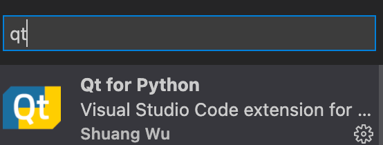
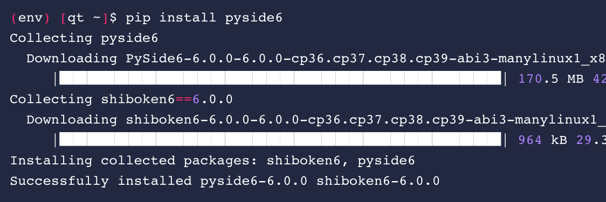

https://doc.qt.io/qtforpython-6/tutorials/index.html#before-you-start)

# Before you start

第一个部分是PyQt的基础部分，首先需要区分Qt，QML，Widget：

## Qt，QML，Widge

> Keep in mind that Qt was designed and written in C++ as a C++ framework, you will find many references, examples, and concepts that make sense in C++ based applications, that might not be relevant in your Python applications, but keep in mind that Qt for Python aims to expose the Qt framework to Python with many adaptations

Qt原本是一个c++框架，PyQt是Qt向python的移植版，但是学习PyQt并不需要了解c++具体语法

### Qt

Qt是一个框架，内部包含许多组件，每个组件又包含子组件和子模块，例如`qtbase`就是一个Qt组件，下辖有多个模块： `QtCore`, `QtGui`, `QtWidgets`, `QtNetwork`, 每个模块又有许多python类。`QtCore`中就有 `QFile`, `QTime`, `QByteArray`, 等python类。

理论上，就算不创建用户界面，也可以通过Qt组件中的pyhton类实现命令行应用：文件处理、网络连接、文字处理等。

但是，如果你想创建用户界面等话，Qt中的`QtWidget`组件可以提供相应的功能。在教程中其也被称为**Widget**。

除了`QtWidget`组件之外，还有 `QtMultimedia`, `QtCharts`, `Qt3D`, 等其他组件可以实现各种功能。其中比较特殊的是`QtDeclarative`，其中包含了`QML`语言等具体定义，`QML`语言类似于CSS和JSON，用来处理UI中的布局，可以在其中使用部分JavaScript来控制布局，也可以控制引用部分C++。

### Widget

`QtWidget`，直译为Qt小组件，可以帮助添加图形应用：例如按钮、标签、Boxes、菜单等。

外观将会直接是所运行操作系统的原生UI

> 虽然外观默认是原生UI，但是是可以后期修改的

### QML

QML是一种语言标准，在Qt中对应的是`Qt Quick`模组。其提供了除了`QtWidget`之外的另一种创建用户界面的方式。`Qt Quick`模组也提供了移动设备中的交互方式，例如：点击、拖拽和放置、动画、状态、转移、自定义菜单等。

`Qt Quick`提供了更动态的统一结构。

即使`Qt Quick`面向移动设备，但是其架构也可在桌面端运行。同时也可在`QML`语言中添加javascript和c++来实现更多功能。

### Python And C++

学习PyQt并不需要关于c++的知识，但是在以下几种情况下需要将python和c++混合使用：

1、将一个c++Qt应用转写为一个pythonQt应用

2、在一个pythonQt应用中使用一个用c++编写的Qt widget

3、在Qt/c++应用中使用了c++编写的库

4、为Qt/c++应用编写python拓展

未来将Qt/c++转写为Qt/python，可以使用`Shiboken`

## IDE设置

官方IDE有`QtCreate`、`Designer`

注意有些时候需要在命令行对`.ui`和`.qrc`文件进行转译：

```bash
pyside6-uic -i form.ui -o ui_form.py
```

```bash
pyside6-rcc -i resources.qrc -o rc_resources.py
```

### Vscode 安装插件



## Binding Generation: What Is Shiboken?

在安装PySide6（PyQt的python包名称）时，会自动安装Shiboken6



要注意要使用转译功能需要再安装一个包：`Shiboken Generator`

如果只是要使用PyQt创建新的应用，则不需要安装**Shiboken Generator**

## File Types

在开发PyQt应用时要使用到不同类型的文件：`.ui`	`.qrc`	`.qml` `.py`等

### `.py`

其实，理论上所有的项目开发过程完全可以用python文件代替，但是在`.ui`	`.qrc`	`.qml` `.py`等类型的文件帮助下可以加速开发过程，并引入更多的开发功能。

典型代码块实例：

```python
class MyWidget(QWidget):
    def __init__(self):
        QWidget.__init__(self)

        self.hello = ["Hallo Welt", "你好，世界", "Hei maailma",
            "Hola Mundo", "Привет мир"]

        self.button = QPushButton("Click me!")
        self.text = QLabel("Hello World")
        self.text.setAlignment(Qt.AlignCenter)
        # ...
```

### UI定义文件`.ui`

当利用官方的IDE`Qt Designer`时，可以通过WYSIWYG（What You See Is What You Get）方式利用`Qt Widget`创建UI，IDE会生成`XML`类的文件，即描述UI布局的`.ui`文件，如下时一个典型的`.ui`的开头实例：

```xml
<?xml version="1.0" encoding="UTF-8"?>
<ui version="4.0">
 <class>MainWindow</class>
 <widget class="QMainWindow" name="MainWindow">
  <property name="geometry">
   <rect>
    <x>0</x>
    <y>0</y>
    <width>400</width>
    <height>300</height>
   </rect>
  </property>
  <property name="windowTitle">
   <string>MainWindow</string>
  </property>
  <widget class="QWidget" name="centralWidget">
...
```

如果要将一个`.ui`文件转换为python项目文件，则需要使用pyside6-uic工具


### 资源收集文件`.qrc`

 该文件会列举应用中使用到的二进制文件，也是一个`XML`类型文件，典型代码为：

```xml
<!DOCTYPE RCC><RCC version="1.0">
<qresource>
    <file>images/quit.png</file>
    <file>font/myfont.ttf</file>
</qresource>
</RCC>
```

可以使用pyside6-rcc 工具将`.qrc`转译为python文件


### Qt模型文件`.qml`

使用`Qt Quick`库开发的UI应用被称为QML应用，QML应用和`QtWidget`没有关系，所以通常来讲会在一个python文件中直接引用一个QML文件，使用python定义的类也可以在QML中使用。

开发者可以手写`.qml`文件，也可以通过官方的`QML Designer`直接生成（`QML Designer`嵌入在`Qt Creater`之中）同时，商业软件`Qt Designer Studio`也有同样的功能。

典型的`QML`文件结构如下：

```javascript
import QtQuick 2.0

Rectangle {
    id: page
    width: 320;
    height: 480
    color: "lightgray"

    Text {
        id: helloText
        text: "Hello world!"
        y: 30
        anchors.horizontalCenter: page.horizontalCenter
        font.pointSize: 24;
        font.bold: true
    }
}
```


### Qt Creator 中的python项目文件 `.pyproject`

如果要让Qt Creater读取和处理pyQt的项目，则需要一种特定的文件，即`.pyproject`，这是一种基于JSON的文件格式，实例为：

```json
{
    "files": ["library/server.py", "library/client.py", "logger.py", ...]
}
```

## 将应用部署到其他系统或平台

Python 应用程序的部署过程称为“冻结（freezing）[^1]”，即将您的虚拟环境内容分发给其他用户，换句话说就是创建二进制可执行文件（exe、dmg等）。

[^1]: [Freezing Your Code — The Hitchhiker's Guide to Python (python-guide.org)](https://docs.python-guide.org/shipping/freezing/)

| Solution    | Windows | Linux | OS X | Python 3 | License | One-file mode | Zipfile import | Eggs | pkg_resources support | Latest release date |
| :---------- | :------ | :---- | :--- | :------- | :------ | :------------ | :------------- | :--- | :-------------------- | :------------------ |
| bbFreeze    | yes     | yes   | yes  | no       | MIT     | no            | yes            | yes  | yes                   | Jan 20, 2014        |
| py2exe      | yes     | no    | no   | yes      | MIT     | yes           | yes            | no   | no                    | Oct 21, 2014        |
| pyInstaller | yes     | yes   | yes  | yes      | GPL     | yes           | no             | yes  | no                    | Jul 9, 2019         |
| cx_Freeze   | yes     | yes   | yes  | yes      | PSF     | no            | yes            | yes  | no                    | Aug 29, 2019        |
| py2app      | no      | no    | yes  | yes      | MIT     | no            | yes            | yes  | yes                   |                     |

> As Python does not support WebAssembly and mobile platforms, such as Android and iOS, you cannot deploy applications to these platforms directly, and you require advanced processes to do so.
>
> 也就是说，pyQt不能直接部署为ios或安卓应用，但是可以通过一些步骤来做到[^2]

[^2 ]: [qt - Using PySide / PyQt for mobile development - Stack Overflow](https://stackoverflow.com/questions/16723258/using-pyside-pyqt-for-mobile-development) 

结论：如果要在安卓或ios上编写UI，最好使用原生开发工具：Android Studio和Xcode

