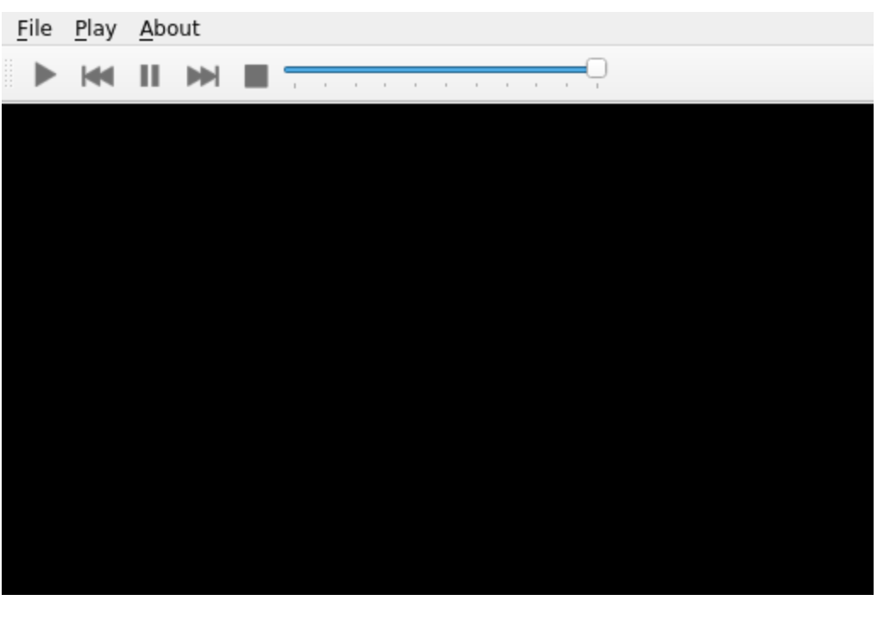

# Qt Widgets: Basic tutorials

一般来讲，创建Qt UI有两种方式：

1. Qt Widgets
2. Quick/QML

首先介绍使用小组件`QtWidget`创建UI

## Your First QtWidgets Application

首先来看一段最简单的Qt应用实例：

```python
import sys
from PySide6.QtWidgets import QApplication, QLabel

app = QApplication(sys.argv)
label = QLabel("Hello World!")
label.show()
app.exec()

```

首先可以看到，需要从`PySide6.QtWidgets`引入应用库

当引入完成之后，就可以创建一个`QApplication`类的实例，在这里，我们将运行系统的系统参数输入进实例的参数里：

```python
app = QApplication(sys.argv)
```

或者也可以不输入任何参数：

```python
app = QApplication([])

```

之后该实例生成了一个`Qlabel`的小组件，该组件可以展示纯文字，也可以展示图片（注意可以使用HTML语法实现更加复杂的内容展示）：

```python
label = QLabel("<font color=red size=40>Hello World!</font>")

```

使用`label.show()`可以将小组件展示到`QApplication`中。最后通过`app.exec()`来进入到Qt主循环中来开始执行Qt代码

## Using a Simple Button

在本节中将介绍中断处理（**signal and slot**）。**signals and slots**是Qt中的特性，该特性可以让图形小组件之间通过python代码进行沟通。本节中将设置一个按钮，每一次点击按钮都会在python命令行显示`Hello`

首先引入相应模组：

```python
import sys
from PySide6.QtWidgets import QApplication, QPushButton
from PySide6.QtCore import Slot
```

定义想执行的动作函数（slot），这里本质上是类似于flask中的修饰器：

```python
# Greetings
@Slot()
def say_hello():
    print("Button clicked, Hello!")
```

接着实例化一个Qt应用：

```python
app = QApplication(sys.argv)
```

按钮是通过一个名为`QPushButton`的类来实现的：

```python
# Create a button
button = QPushButton("Click me")
```

在使用`.show()`函数将button可视化之前，需要将button与之前定义的事件函数`say_hellow()`绑定。绑定有两种方式：

1. 老方法
2. 新方法（更加符合python风格）

`QPushButton`自身有一个`clicked`方法用于绑定事件函数:

```python
# Connect the button to the function
button.clicked.connect(say_hello)
```

最终，将button可视化并执行Qt主函数：

```python
# Show the button
button.show()
# Run the main Qt loop
app.exec()
```

完整代码如下：

```python
#!/usr/bin/python

import sys
from PySide6.QtWidgets import QApplication, QPushButton
from PySide6.QtCore import Slot

@Slot()
def say_hello():
 print("Button clicked, Hello!")

# Create the Qt Application
app = QApplication(sys.argv)
# Create a button, connect it and show it
button = QPushButton("Click me")
button.clicked.connect(say_hello)
button.show()
# Run the main Qt loop
app.exec()
```

## Creating a Dialog Application

本节使用最基本的小组件创建一个Qt会话应用。利用文字输入模块`QLineEdit`让用户输入自己的名字，并通过button链接事件将用户姓名打印在终端里。

首先，写出程序框架：

```python
import sys
from PySide6.QtWidgets import QApplication, QDialog, QLineEdit, QPushButton

class Form(QDialog):

    def __init__(self, parent=None):
        super(Form, self).__init__(parent)
        self.setWindowTitle("My Form")


if __name__ == '__main__':
    # Create the Qt Application
    app = QApplication(sys.argv)
    # Create and show the form
    form = Form()
    form.show()
    # Run the main Qt loop
    sys.exit(app.exec())
```

一共三步，~~请客、斩首、手下当狗~~，创建Qt应用、创建Qt小组件，执行Qt主函数

注意这里使用的是自己创建的`Form`类，该类继承自Qt中的`QDialog`组件，在`Form`类中，继承了`QDialog`的初始化函数，并自定义了该窗口的标题文字。

### 创建小组件

要实现文中所期望的功能，需要两种组件：`QLineEdit`使得用户可以输入，`QPushButton`使得用户可以打印信息。现在在`Form`类中添加这两个组件：

```python
# Create widgets
self.edit = QLineEdit("Write my name here..")
self.button = QPushButton("Show Greetings")
```

输入参数是默认文字。

### 创建布局并进行小组件的排版

Qt语言支持对`layout`进行编辑。在本文对例子中，使用`*QVBoxLayout*`对所有小组件进行纵向排布。在`Form`对初始化中，在创建各个小组件之后执行以下代码：

```python
#Create layout and add widgets
layout = QVBoxLayout(self)
layout.addWidget(self.edit)
layout.addWidget(self.button)
```

layout在初始化完成之后可以通过`.addWidget()`方法添加组件。

### 创建打印信息的事件函数并绑定

在概念上来讲，该打印函数也是`Form`的方法，所以将打印函数`greetings()`写在`Form`类中：

```python
# Greets the user
def greetings(self):
    print(f"Hello {self.edit.text()}")
```

f表示python字符串的格式化输出，可以将`{}`中的变量展开

该动作函数直接输出用户在`QLineEdit`中的输入，`QLineEdit.text()`可以直接获取用户在输入表格中输入的文字。

接下来只需要将button和对应事件绑定：

```python
# Add button signal to greetings slot
self.button.clicked.connect(self.greetings)
```

### 完整代码

```python
import sys
from PySide6.QtWidgets import (QLineEdit, QPushButton, QApplication,
    QVBoxLayout, QDialog)

class Form(QDialog):

    def __init__(self, parent=None):
        super(Form, self).__init__(parent)
        # Create widgets
        self.edit = QLineEdit("Write my name here")
        self.button = QPushButton("Show Greetings")
        # Create layout and add widgets
        layout = QVBoxLayout()
        layout.addWidget(self.edit)
        layout.addWidget(self.button)
        # Set dialog layout
        self.setLayout(layout)
        # Add button signal to greetings slot
        self.button.clicked.connect(self.greetings)

    # Greets the user
    def greetings(self):
        print(f"Hello {self.edit.text()}")

if __name__ == '__main__':
    # Create the Qt Application
    app = QApplication(sys.argv)
    # Create and show the form
    form = Form()
    form.show()
    # Run the main Qt loop
    sys.exit(app.exec())
```

运行效果


## Displaying Data Using a Table Widget

如果想用表格展示数据的话，可以使用`QTableWidget`模块。

`QTableWidget`只是展示表格的其中一种方式，也可以使用`QTableView`

> 需要注意的是，本教程只是python入门教程，但是python只是提供一个接入Qt库的api，Qt模组的详细介绍在[Qt Widgets 6.1.2](https://doc.qt.io/qt-6/qtwidgets-index.html)
>
> 

1. 引入库
```python
mport sys
from PySide6.QtGui import QColor
from PySide6.QtWidgets import (QApplication, QTableWidget,
                               QTableWidgetItem)
```
2. 创建数据索引和内容
```python
colors = [("Red", "#FF0000"),
          ("Green", "#00FF00"),
          ("Blue", "#0000FF"),
          ("Black", "#000000"),
          ("White", "#FFFFFF"),
          ("Electric Green", "#41CD52"),
          ("Dark Blue", "#222840"),
          ("Yellow", "#F9E56d")]
```
3. 转换颜色数据格式
```python
def get_rgb_from_hex(code):
    code_hex = code.replace("#", "")
    rgb = tuple(int(code_hex[i:i+2], 16) for i in (0, 2, 4))
    return QColor.fromRgb(rgb[0], rgb[1], rgb[2])
```
4. 初始化Qt应用
```python
app = QApplication()
```
5. 初始化表格组件
```python
table = QTableWidget()
table.setRowCount(len(colors))
table.setColumnCount(len(colors[0]) + 1)
table.setHorizontalHeaderLabels(["Name", "Hex Code", "Color"])
```
6. 设置循环来编辑表格内容
```python
for i, (name, code) in enumerate(colors):
    item_name = QTableWidgetItem(name)
    item_code = QTableWidgetItem(code)
    item_color = QTableWidgetItem()
    item_color.setBackground(get_rgb_from_hex(code))
    table.setItem(i, 0, item_name)
    table.setItem(i, 1, item_code)
    table.setItem(i, 2, item_color)
```
7. 将组件可视化并执行主程序

```python
table.show()
sys.exit(app.exec())
```

## Displaying Data Using a Tree Widget

略

## 安装和使用Qt designer

[PyQt6 Qt Designer安装启动/打开 - 弟球嗑学 (geocalculate.com)](https://www.geocalculate.com/7495.html)

```bash
pip install pyqt6-tools
```


默认情况下，PyQt5或PyQt6不会默认安装**Qt Designer**, 我们需要额外安装一个包，叫做**pyqt5-tools**。虽然看名称显然是为PyQt5设计的，不过不用担心，PyQt6同样可以使用。

## Using .ui files from Designer or QtCreator with QUiLoader and pyside6-uic

`.ui`文件定义了GUI布局，该文件可以用两种方式生成：

1. 独立工具`pyside6-designer`（推荐）

2. 下载完整版`Qt Creator`

启动Qt designer 在mac上可以用：

```
open -a Designer
```

```xml
<?xml version="1.0" encoding="UTF-8"?>
<ui version="4.0">
 <class>MainWindow</class>
 <widget class="QMainWindow" name="MainWindow">
  <property name="geometry">
   <rect>
    <x>0</x>
    <y>0</y>
    <width>400</width>
    <height>300</height>
   </rect>
  </property>
  <property name="windowTitle">
   <string>MainWindow</string>
  </property>
  <widget class="QWidget" name="centralWidget">
   <widget class="QPushButton" name="pushButton">
    <property name="geometry">
     <rect>
      <x>110</x>
      <y>80</y>
      <width>201</width>
      <height>81</height>
     </rect>
    </property>
    <property name="text">
     <string>PushButton</string>
    </property>
   </widget>
  </widget>
  <widget class="QMenuBar" name="menuBar">
   <property name="geometry">
    <rect>
     <x>0</x>
     <y>0</y>
     <width>400</width>
     <height>20</height>
    </rect>
   </property>
  </widget>
  <widget class="QToolBar" name="mainToolBar">
   <attribute name="toolBarArea">
    <enum>TopToolBarArea</enum>
   </attribute>
   <attribute name="toolBarBreak">
    <bool>false</bool>
   </attribute>
  </widget>
  <widget class="QStatusBar" name="statusBar"/>
 </widget>
 <layoutdefault spacing="6" margin="11"/>
 <resources/>
 <connections/>
</ui>
```

### Option A: Generating a Python class

为了编辑`.ui`文件，可以通过将`.ui`文件转译为python文件：

```python
pyside6-uic mainwindow.ui > ui_mainwindow.py

```

为了将生成的python布局文件和python代码绑定：

```python
import sys
from PySide6.QtWidgets import QApplication, QMainWindow
from PySide6.QtCore import QFile
from ui_mainwindow import Ui_MainWindow

class MainWindow(QMainWindow):
    def __init__(self):
        super(MainWindow, self).__init__()
        self.ui = Ui_MainWindow()
        self.ui.setupUi(self)

if __name__ == "__main__":
    app = QApplication(sys.argv)

    window = MainWindow()
    window.show()

    sys.exit(app.exec())
```

其中以下两句是绑定的关键：

```
self.ui = Ui_MainWindow()
self.ui.setupUi(self)
```

`Ui_MainWindow`是之前自动生成的python代码中定义的布局

### Option B: Loading it directly

很显然，另一种方式就是不改变文件的后缀，通过`QUiLoader`

之间将布局文件引入：

```python
from PySide6.QtUiTools import QUiLoader

```

则ui文件被引入的语句为：

```python
ui_file = QFile("mainwindow.ui")
ui_file.open(QFile.ReadOnly)

loader = QUiLoader()
window = loader.load(ui_file)
window.show()
```

以上过程的完整代码为：

```python
# File: main.py
import sys
from PySide6.QtUiTools import QUiLoader
from PySide6.QtWidgets import QApplication
from PySide6.QtCore import QFile, QIODevice

if __name__ == "__main__":
    app = QApplication(sys.argv)

    ui_file_name = "mainwindow.ui"
    ui_file = QFile(ui_file_name)
    if not ui_file.open(QIODevice.ReadOnly):
        print(f"Cannot open {ui_file_name}: {ui_file.errorString()}")
        sys.exit(-1)
    loader = QUiLoader()
    window = loader.load(ui_file)
    ui_file.close()
    if not window:
        print(loader.errorString())
        sys.exit(-1)
    window.show()

    sys.exit(app.exec())
```

### Custom Widgets in Qt Designer

在Qt Designer软件中支持引入第三方小组件，但是只允许使用C++编写的组件。

pyQt提供了一种简单的自定义第三方小组件的方法，可以直接以python类的形式编写：

`registerCustomWidget()`

```python
# File: registerwigglywidget.py
from wigglywidget import WigglyWidget
import QtDesigner


TOOLTIP = "A cool wiggly widget (Python)"
DOM_XML = """
<ui language='c++'>
    <widget class='WigglyWidget' name='wigglyWidget'>
        <property name='geometry'>
            <rect>
                <x>0</x>
                <y>0</y>
                <width>400</width>
                <height>200</height>
            </rect>
        </property>
        <property name='text'>
            <string>Hello, world</string>
        </property>
    </widget>
</ui>
"""

QPyDesignerCustomWidgetCollection.registerCustomWidget(WigglyWidget, module="wigglywidget",
                                                       tool_tip=TOOLTIP, xml=DOM_XML)
```

### Using .qrc Files (pyside6-rcc)

> The [Qt Resource System](https://doc.qt.io/qt-5/resources.html) is a mechanism for storing binary files in an application.

在`.qrc`中列出的资源在打包时会一并被嵌入到二进制执行文件中。`QFile`, `QIcon`, `Qpixmap`通过特殊字符`:/`来识别指定资源。

在本节中，会以一个多媒体播放器为例



可以看到，该播放器的按钮都是默认的图标。接下来我们将图标替换为以下的图片：


### The .qrc file

首先介绍`.qrc`文件，以下是名为`icons.qrc`的实例：

```xml
</ui>
<!DOCTYPE RCC><RCC version="1.0">
<qresource>
    <file>icons/play.png</file>
    <file>icons/pause.png</file>
    <file>icons/stop.png</file>
    <file>icons/previous.png</file>
    <file>icons/forward.png</file>
</qresource>
</RCC>
```

