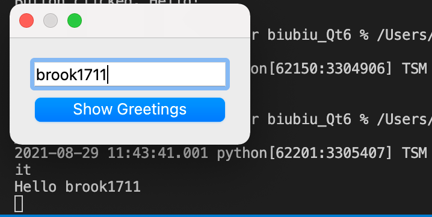

# Qt Widgets: Basic tutorials

一般来讲，创建Qt UI有两种方式：

1. Qt Widgets
2. Quick/QML

首先介绍使用小组件`QtWidget`创建UI

## Your First QtWidgets Application

首先来看一段最简单的Qt应用实例：

```python
import sys
from PySide6.QtWidgets import QApplication, QLabel

app = QApplication(sys.argv)
label = QLabel("Hello World!")
label.show()
app.exec()

```

首先可以看到，需要从`PySide6.QtWidgets`引入应用库

当引入完成之后，就可以创建一个`QApplication`类的实例，在这里，我们将运行系统的系统参数输入进实例的参数里：

```python
app = QApplication(sys.argv)
```

或者也可以不输入任何参数：

```python
app = QApplication([])

```

之后该实例生成了一个`Qlabel`的小组件，该组件可以展示纯文字，也可以展示图片（注意可以使用HTML语法实现更加复杂的内容展示）：

```python
label = QLabel("<font color=red size=40>Hello World!</font>")

```

使用`label.show()`可以将小组件展示到`QApplication`中。最后通过`app.exec()`来进入到Qt主循环中来开始执行Qt代码

## Using a Simple Button

在本节中将介绍中断处理（**signal and slot**）。**signals and slots**是Qt中的特性，该特性可以让图形小组件之间通过python代码进行沟通。本节中将设置一个按钮，每一次点击按钮都会在python命令行显示`Hello`

首先引入相应模组：

```python
import sys
from PySide6.QtWidgets import QApplication, QPushButton
from PySide6.QtCore import Slot
```

定义想执行的动作函数（slot），这里本质上是类似于flask中的修饰器：

```python
# Greetings
@Slot()
def say_hello():
    print("Button clicked, Hello!")
```

接着实例化一个Qt应用：

```python
app = QApplication(sys.argv)
```

按钮是通过一个名为`QPushButton`的类来实现的：

```python
# Create a button
button = QPushButton("Click me")
```

在使用`.show()`函数将button可视化之前，需要将button与之前定义的事件函数`say_hellow()`绑定。绑定有两种方式：

1. 老方法
2. 新方法（更加符合python风格）

`QPushButton`自身有一个`clicked`方法用于绑定事件函数:

```python
# Connect the button to the function
button.clicked.connect(say_hello)
```

最终，将button可视化并执行Qt主函数：

```python
# Show the button
button.show()
# Run the main Qt loop
app.exec()
```

完整代码如下：

```python
#!/usr/bin/python

import sys
from PySide6.QtWidgets import QApplication, QPushButton
from PySide6.QtCore import Slot

@Slot()
def say_hello():
 print("Button clicked, Hello!")

# Create the Qt Application
app = QApplication(sys.argv)
# Create a button, connect it and show it
button = QPushButton("Click me")
button.clicked.connect(say_hello)
button.show()
# Run the main Qt loop
app.exec()
```

## Creating a Dialog Application

本节使用最基本的小组件创建一个Qt会话应用。利用文字输入模块`QLineEdit`让用户输入自己的名字，并通过button链接事件将用户姓名打印在终端里。

首先，写出程序框架：

```python
import sys
from PySide6.QtWidgets import QApplication, QDialog, QLineEdit, QPushButton

class Form(QDialog):

    def __init__(self, parent=None):
        super(Form, self).__init__(parent)
        self.setWindowTitle("My Form")


if __name__ == '__main__':
    # Create the Qt Application
    app = QApplication(sys.argv)
    # Create and show the form
    form = Form()
    form.show()
    # Run the main Qt loop
    sys.exit(app.exec())
```

一共三步，~~请客、斩首、手下当狗~~，创建Qt应用、创建Qt小组件，执行Qt主函数

注意这里使用的是自己创建的`Form`类，该类继承自Qt中的`QDialog`组件，在`Form`类中，继承了`QDialog`的初始化函数，并自定义了该窗口的标题文字。

### 创建小组件

要实现文中所期望的功能，需要两种组件：`QLineEdit`使得用户可以输入，`QPushButton`使得用户可以打印信息。现在在`Form`类中添加这两个组件：

```python
# Create widgets
self.edit = QLineEdit("Write my name here..")
self.button = QPushButton("Show Greetings")
```

输入参数是默认文字。

### 创建布局并进行小组件的排版

Qt语言支持对`layout`进行编辑。在本文对例子中，使用`*QVBoxLayout*`对所有小组件进行纵向排布。在`Form`对初始化中，在创建各个小组件之后执行以下代码：

```python
#Create layout and add widgets
layout = QVBoxLayout(self)
layout.addWidget(self.edit)
layout.addWidget(self.button)
```

layout在初始化完成之后可以通过`.addWidget()`方法添加组件。

### 创建打印信息的事件函数并绑定

在概念上来讲，该打印函数也是`Form`的方法，所以将打印函数`greetings()`写在`Form`类中：

```python
# Greets the user
def greetings(self):
    print(f"Hello {self.edit.text()}")
```

f表示python字符串的格式化输出，可以将`{}`中的变量展开

该动作函数直接输出用户在`QLineEdit`中的输入，`QLineEdit.text()`可以直接获取用户在输入表格中输入的文字。

接下来只需要将button和对应事件绑定：

```python
# Add button signal to greetings slot
self.button.clicked.connect(self.greetings)
```

### 完整代码

```python
import sys
from PySide6.QtWidgets import (QLineEdit, QPushButton, QApplication,
    QVBoxLayout, QDialog)

class Form(QDialog):

    def __init__(self, parent=None):
        super(Form, self).__init__(parent)
        # Create widgets
        self.edit = QLineEdit("Write my name here")
        self.button = QPushButton("Show Greetings")
        # Create layout and add widgets
        layout = QVBoxLayout()
        layout.addWidget(self.edit)
        layout.addWidget(self.button)
        # Set dialog layout
        self.setLayout(layout)
        # Add button signal to greetings slot
        self.button.clicked.connect(self.greetings)

    # Greets the user
    def greetings(self):
        print(f"Hello {self.edit.text()}")

if __name__ == '__main__':
    # Create the Qt Application
    app = QApplication(sys.argv)
    # Create and show the form
    form = Form()
    form.show()
    # Run the main Qt loop
    sys.exit(app.exec())
```

运行效果



## Displaying Data Using a Table Widget

