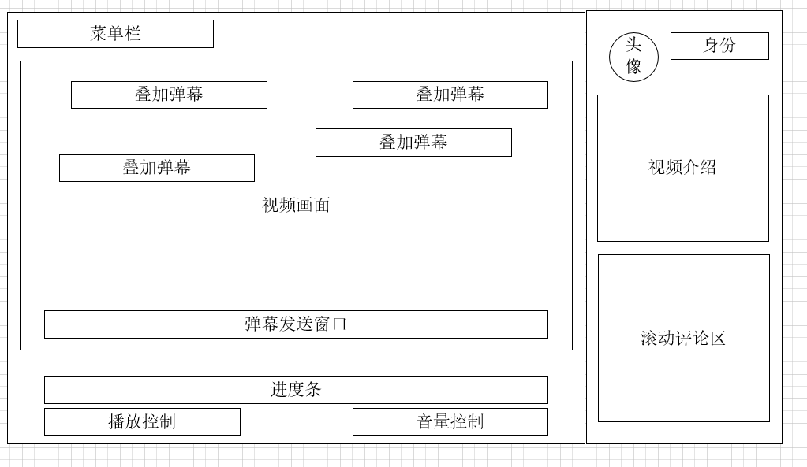
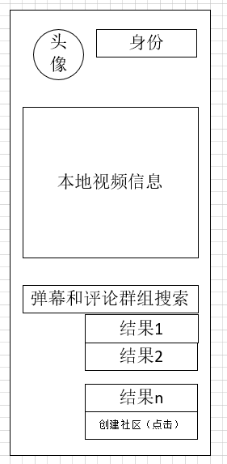
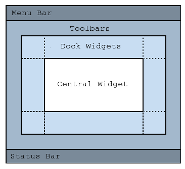

# biubiu_Qt6
biubiu project by Qt6

终于，向浏览器恶势力低头了

QT官网教程解读 [官网链接](https://doc.qt.io/qtforpython-6/tutorials/index.html#before-you-start)

tk+vlc代码参考：[git.videolan.org Git - vlc/bindings/python.git/blob - examples/tkvlc.py](https://git.videolan.org/?p=vlc/bindings/python.git;a=blob;f=examples/tkvlc.py;h=9984138afa37132ad1279e55d66eb7b705e21b98;hb=HEAD)

vlc dll参考：[Python 流媒体播放器（基于VLC）_血色@残阳的专栏-CSDN博客_python vlc](https://blog.csdn.net/yingshukun/article/details/89527561)

vlc 源码：[Index of /pub/videolan/vlc/last/win64/](http://download.videolan.org/pub/videolan/vlc/last/win64/)

exe打包二进制：pyinstaller

Pyinstaller -F -i 1.ico tkvlc.py
Pyinstaller -F -i 1.ico qt_vlc.py

Mac:py2app

py2applet --make-setup main.py

python3 setup.py py2app -A

pyinstaller --windowed --onefile --clean --noconfirm main.py
pyinstaller --clean --noconfirm --windowed --onefile main.spec

pip install cx_Freeze

## 结构规划

评论和弹幕出现之前：

## 基于vlc

运行时保证vlc库与可执行文件位于同一个目录下

## Qt窗口类型
https://www.cnblogs.com/laizhenghong2012/p/10085089.html

## Layout

左右两个组件使用两个不同的`QLayout`来包装，这样调整格式的时候只需要对`layout`进行属性调整

### RightLayout

右边栏设计为用户和视频信息以及搜索栏三大块

#### 用户信息

[(54条消息) pyqt显示圆形图片_YH_24H的博客-CSDN博客](https://blog.csdn.net/YH_24H/article/details/107919748)

#### 视频信息

主要来源python-vlc中的Media类和MediaPlayer类：

[vlc.Media (olivieraubert.net)](https://www.olivieraubert.net/vlc/python-ctypes/doc/vlc.Media-class.html#get_meta)

[vlc.MediaPlayer (olivieraubert.net)](https://www.olivieraubert.net/vlc/python-ctypes/doc/vlc.MediaPlayer-class.html)

## Widget

### spliter

由于分为左右边栏形式，主组件采用的是`QSpliter`模块

[QSplitter — Qt for Python](https://doc.qt.io/qtforpython/PySide6/QtWidgets/QSplitter.html)

参考以下链接将左右边栏设置为可拖动调节大小

[qt - Semi-resizable widgets in PyQt - Stack Overflow](https://stackoverflow.com/questions/32891789/semi-resizable-widgets-in-pyqt)

